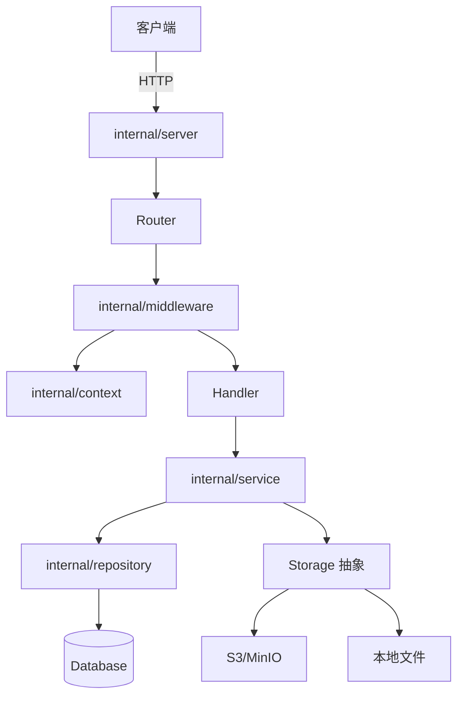

# 知识图谱

## 模块关系

## 当前已规划模块

| 模块 | 职责 |
|------|------|
| cmd/server | 服务入口 |
| internal/config | 配置加载 |
| internal/context | 请求上下文（租户、用户） |
| internal/middleware | HTTP 中间件（租户识别、日志、恢复） |
| internal/server | HTTP 服务器与路由注册 |
| internal/domain | 领域模型 |
| internal/service | 业务逻辑 |
| internal/repository | 数据访问 |
| internal/api | HTTP handler |
| internal/security | 认证与权限 |
| pkg | 公共库 |
| .codex | 协作记录 |

## 数据流

1. 请求到达 Nginx / Server
2. Middleware 识别 tenant
3. Context 携带 tenant 进入 Handler
4. Handler 调用 Service
5. Service 调用 Repository，Repository 自动注入 tenant 过滤
6. 返回响应
