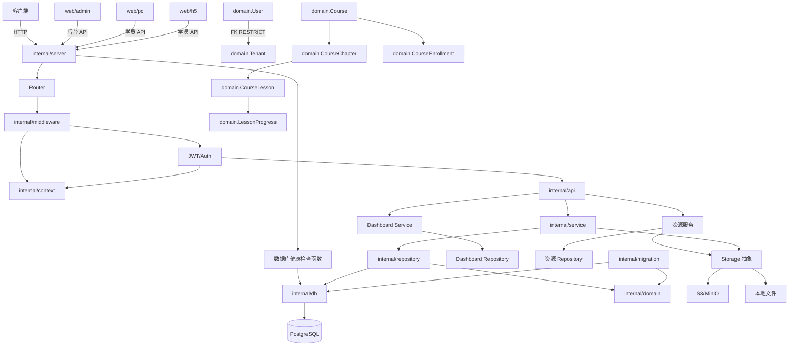

# 知识图谱

## 模块关系

## 当前已规划模块

| 模块 | 职责 |
|------|------|
| cmd/server | 服务入口 |
| internal/config | 配置加载 |
| internal/context | 租户与 JWT 用户请求上下文 |
| internal/middleware | 租户识别与 JWT 认证 |
| internal/server | HTTP 服务器与路由注册 |
| internal/db | PostgreSQL 连接、连接池与健康检查 |
| internal/domain | 租户、用户、课程、报名、进度与资源模型 |
| internal/migration | 核心领域模型的 GORM 自动迁移 |
| internal/service | 认证、课程指派、学习进度、资源及角色检查 |
| internal/repository | GORM 数据访问与租户、用户范围隔离 |
| internal/api | 认证、课程、指派、进度与资源 Handler |
| dashboard | 租户级用户、课程、学习与完成率聚合 |
| internal/storage | 存储抽象及安全的本地文件驱动 |
| internal/security | bcrypt 与 JWT |
| internal/errorsx | 应用错误码与 HTTP 错误响应 |
| web/admin | React 管理后台 |
| web/pc | React PC 学员端 |
| web/h5 | React H5 学员端 |
| pkg | 公共库 |
| .codex | 协作记录 |

## 数据流

1. 请求到达 Nginx / Server
2. Middleware 识别 tenant
3. Auth 验证 JWT，将 user 与 tenant_id 写入 Context
4. Handler 进行简单角色检查并调用 Service
5. Service 调用 Repository，用户查询强制按 tenant_id 过滤
6. 启动时 Migration 自动创建或更新核心领域表
7. `/health/db` 通过注入函数检查数据库连通性
8. 返回响应
9. 上传资源经 MIME/大小校验后写入存储并记录资源元数据
10. Dashboard Repository 以 UTC 日界和 tenant_id 聚合统计

---

## 后续模块规划

| 模块/任务 | 说明 |
|-----------|------|
| cmd/init | superadmin 初始化脚本 |
| Swagger/OpenAPI | API 文档自动生成 |
| Dockerfile / compose.yml | 容器化部署 |
| 前端路由懒加载 | 优化打包体积 |
