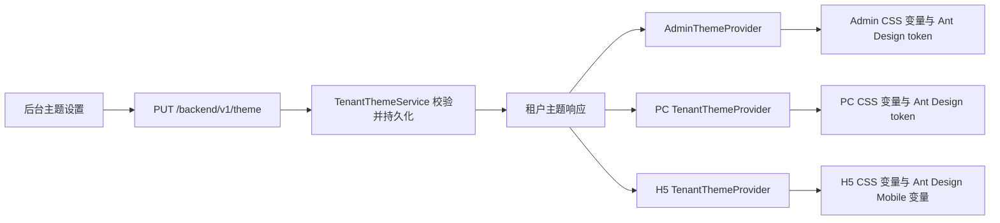

# ImaiPlay 全端 UI 与主题联动改版设计

## 目标

在已完成的 PC 学员端基础上，统一改造管理后台和 H5 学员端，并确保租户管理员在后台保存品牌配置后，管理后台、PC 学员端和 H5 学员端使用同一主题数据即时更新。业务流程、权限、路由和学习进度协议保持不变。

## 方案选择

### 方案 A：各端独立视觉、共享主题契约与分级 Claymorphism（采用）

管理后台采用紧凑的数据管理界面和克制的 3D 层级，PC 学员端采用宽松、具有明显触感的 Claymorphism 学习界面，H5 采用移动优先的 Claymorphism 界面。三端共享颜色语义、品牌字段、对比度算法和换肤行为，但不强行共享具体组件或 CSS。

优点是每端都符合使用场景，主题联动仍保持一致；缺点是三端各有一套样式实现，需要契约测试防止漂移。

### 方案 B：三端强制共用组件库

抽取统一 React 组件和 CSS 包。长期复用度高，但 Ant Design 与 Ant Design Mobile 的组件模型不同，当前改造会引入大量跨包重构，不符合本轮“不改变业务逻辑”的约束。

### 方案 C：仅覆盖现有 CSS

改动最少，但当前 Admin 和 H5 已存在多层历史样式覆盖，继续叠加会造成颜色硬编码、响应式冲突和主题变量失效，无法稳定验收。

## 设计系统

三端统一使用以下语义：

- 品牌色：`accent`、`accent-hover`、`accent-light`、`accent-soft`、`accent-strong`。
- 状态色：`success`、`warning`、`danger`、`info` 及浅色背景。
- 中性色：`heading`、`text`、`muted`、`page`、`card`、`border`。
- 特殊表面：导航毛玻璃、播放器深色表面、白色叠加层和三级无彩色阴影。
- 选中态：继续独立使用 `selected_background_color`、`selected_text_color`、`selected_icon_color`，避免品牌主色与菜单可读性互相绑定。
- Clay 表面：彩色对象同时具备顶部柔光、同色系实体接触阴影和低透明度氛围阴影；白色对象使用中性浅色接触阴影。
- Clay 动效：按钮静止深度为 6px，hover 压缩 2px，active 下压 6px；交互过渡为 `100ms ease-out`。
- 圆角：学员端可见卡片与按钮不低于 12px，主卡片 20–24px，进度条使用完整胶囊圆角；管理后台密集控件保持 10–14px，以可读性优先。

主题色字面量只允许存在于 palette 或共享主题默认值中。页面、组件和样式表只引用 CSS 变量或组件主题 token。

### 分级 Claymorphism 规则

#### 学员 PC 与 H5

- 主按钮、课程卡片、统计卡片、继续学习 Hero、图标容器和进度条使用完整 Clay 深度。
- 彩色表面使用顶部径向柔光，但不做玻璃质感或高反射塑料质感。
- 卡片实体底影为 6–8px；彩色底影必须是当前对象颜色更深、更饱和的派生色，不能使用固定蓝色或灰色。
- 页面最多使用 2–4 个低透明度品牌色 Blob，并位于内容后方；H5 减少模糊尺寸和数量。
- 不对文字或裸 SVG 添加阴影；图标先放进 Clay 图标容器。
- 课程、统计和进度场景可以具有温暖、奖励感，但不增加与业务无关的插画或游戏机制。

#### 管理后台

- 主按钮、Dashboard 指标卡、快捷入口、侧栏选中态和主题预览使用浅层 Clay 效果。
- 表格、筛选栏、长表单、编辑器和弹窗正文保持较平整的白色表面，只用边框和轻微层级，避免影响信息密度。
- 次要按钮仍为有实体感的白色表面，不使用只有描边的幽灵按钮；表格行内文字操作除外。
- 不旋转业务卡片，不使用大面积装饰 Blob，不改变后台的工具型信息架构。

#### 主题派生

`primary_color` 除派生现有的 hover/light/soft/strong 色之外，还派生：

- `clay-surface`：用于品牌 Clay 表面，必要时适度提亮主色。
- `clay-shadow`：用于零模糊实体接触阴影，是主色更深、更饱和的版本。
- `clay-atmosphere`：相同色相的透明氛围阴影。
- `clay-highlight`：白色低透明度顶部高光。

这些值由各端 palette 的同一算法生成并由 `apply*Palette()` 注入 CSS 变量，不作为新字段存入数据库。后台修改主色后，按钮表面、实体底影、氛围阴影、Hero 和进度条同步更新。

## 主题数据流

后台保存成功后继续派发 `tenant-theme-changed`，当前管理后台立即重新拉取主题；PC 和 H5 在加载租户门户时从门户主题响应读取相同字段。后端已有字段和持久化能力，不新增数据库列；仅在发现跨端契约缺口时补充测试或最小修复。

## 管理后台

### 页面框架

- 左侧导航保持角色权限和折叠行为，视觉改为 220px 紧凑 SaaS 侧栏。
- 顶栏展示页面上下文、账户身份和操作入口，保持移动端 Drawer。
- 内容区统一最大宽度、页面标题、卡片、表格、筛选栏、分页、弹窗和表单间距。
- 所有 Ant Design 组件通过 `AdminThemeProvider` 的 token 和 CSS 变量联动主题。
- Dashboard 指标和主要动作采用轻量 Clay 卡片；表格、筛选和大表单保持平整。

### 页面覆盖

- 登录、Dashboard。
- 课程、课程详情、官方课程、课程分类。
- 用户、租户、套餐、审计日志。
- 资源、资源分类、存储设置。
- 短信设置、域名设置、主题设置。
- 复用组件：PageHeader、上传器、导入弹窗、课程材料、资源预览和选择器。

页面的数据查询、提交、权限判断和路由保持不变；优先通过公共布局和共享 class 完成一致化，仅在页面结构无法表达设计时调整 JSX。

### 主题设置页

- 分为品牌基础、颜色系统、品牌资产和实时预览四区。
- 主色变化时，只有仍使用推荐值的选中态颜色才自动同步；用户自定义过的选中态颜色保持不变。
- 同时预览侧栏选中项、按钮、链接、卡片和学员端 Hero。
- 保存前保留现有格式校验和低对比度提示。

## H5 学员端

### 页面框架

- 使用移动优先的安全区、粘性顶部栏和最大 560px 内容宽度。
- 首页包含品牌 Hero、继续学习、三格概览、课程筛选和竖向课程卡片。
- 课程详情包含渐变封面、课程摘要、总体进度、可折叠章节和底部学习按钮。
- 播放页使用深色媒体区、课时信息、细进度条和移动端目录。
- 登录与忘记密码页面使用品牌渐变头部和白色表单卡片。
- 主按钮、课程卡片、统计组件、图标和进度条使用完整 Clay 表面及按压反馈。

原有认证、门户解析、课程加载、资源 URL、断点续播、心跳上报和页面隐藏上报全部保留。

## PC 学员端

以提交 `4636180` 的现代 SaaS 改版作为信息架构基线，在不改变页面结构和业务逻辑的前提下加入完整 Clay 表面、同色系实体阴影和按压反馈，并处理跨端主题契约对齐、可访问性问题和共享默认值漂移。

## 后端与共享包

- `TenantThemeContract` 仍是三端唯一主题字段契约。
- `TenantThemeService` 继续校验六位十六进制颜色、长度、租户权限和默认值。
- `recommendedSelectionColors()` 与 `normalizeSelectionColors()` 继续负责跨端一致的选中态推荐和容错。
- 如果 palette 派生算法需要共享，只抽取纯函数；不让后端保存每个派生色。
- 主题 API 的 GET、PUT 和门户响应增加契约测试，证明相同字段可被三端消费。

## 错误处理

- 主题加载失败时，各端使用靛蓝默认 palette，不能阻塞登录或业务页面。
- 后台主题保存失败时保留当前表单内容并显示错误，不广播主题变更事件。
- 无效颜色由前端归一化和后端校验双重防护。
- 低对比度选中态允许保存前提示，但服务端仍保证格式正确；文字可读性由自动推荐和测试覆盖。

## 响应式与可访问性

- 管理后台在 1200px 以下折叠侧栏，960px 以下使用 Drawer。
- H5 从 320px 到 560px 保持完整布局，并处理安全区。
- 所有交互元素有可见 focus、hover/pressed 状态和最小 44px 移动触控区域。
- 状态不仅依赖颜色，同时使用图标、文字或边框。
- 动画遵守 `prefers-reduced-motion`。
- Clay 按压动画默认不超过 100ms；减少动态效果时取消位移并缩短为近乎即时状态切换。
- 文字、表格和表单字段不通过 3D 阴影表达状态，关键状态同时提供文字或图标。

## 测试与验收

- 测试优先：先补 palette 注入、主题设置同步和样式契约的失败测试，再修改实现。
- `web/admin`: `npm test`、`npm run build`。
- `web/h5`: `npm test`、`npm run build`。
- `web/pc`: `npm test`、`npm run build`，防止主题契约回归。
- `web/shared`: 执行其主题测试与构建命令。
- 后端：`go test ./internal/service ./internal/api ./internal/repository`，若共享主题或 API 有改动则执行 `go test ./...`。
- 对三端样式运行颜色字面量扫描；除 palette/default 定义外不允许硬编码颜色。
- 修改后台主色后验证三端的主按钮、链接、Hero、进度条和 hover；修改选中态三色后验证导航、Tabs 和菜单。
- 验证 Clay 变量完整注入；彩色组件的零模糊接触阴影引用派生的 `clay-shadow`，不得引用固定色。
- 验证主按钮的 resting、hover、active 位移与阴影深度，且动画不超过 100ms。
- 验证管理后台表格和长表单没有应用 6–8px 的重型 Clay 底影。

## 非目标

- 不重写业务 API、权限模型、路由结构或数据实体。
- 不引入新的 UI 框架或 npm 依赖。
- 不把 PC 组件直接移植到 H5。
- 不更改学习进度与心跳协议。
